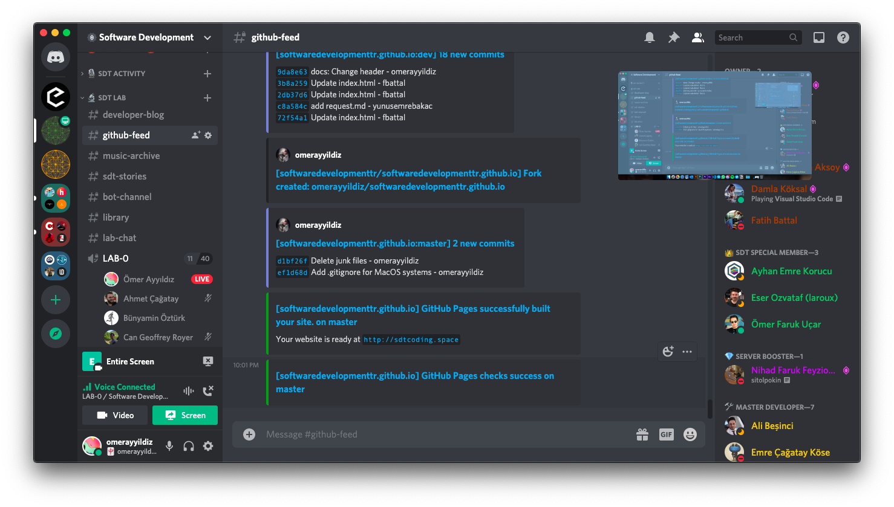

# SDT WEB SAYFASI PROJESİ

## **Projeye Nasıl Katkı Sağlarım?**
Merhaba Dostum,\
Projeye katkı sağlayabilmen öncellikle basit seviyede *git* bilmen gerekiyor. 

Aşağıda bulunan linklerden kolaylıkla başlangıç seviyesinde git öğrenebilirsin:

- [Git Temel Komutlar](https://rogerdudler.github.io/git-guide/index.tr.html)

- [Git, GitHub ve Gitlab Nedir?](https://www.youtube.com/watch?v=rWG70T7fePg&list=PLPrHLaayVkhnNstGIzQcxxnj6VYvsHBHy)

## **Git'i Öğrendim, Peki Ya Şimdi?**

**Şu Komutları Kullanarak Projeye Kodlarınla Katkıda Bulunabilirsin:**

```
1. Site reposunu forklayın

2. git clone https://github.com/username/softwaredevelopmenttr.github.io

3. git remote add sdt https://github.com/softwaredevelopmenttr/softwaredevelopmenttr.github.io.git

4. git pull sdt master

5. Geliştirmenizi yapın.

5. git push -u origin master

6. Github'da forkladığınız repoya girin. Pull request sekmesine gelin.

7. New pull request dedikten sonra "softwaredevelopmenttr:dev from username:master" şeklinde pull request gönderin.

Uyarı: Projeyi her güncellemeden önce, 
   "git pull sdt master"  yapmayı unutmayın!
```
## **Gelişmeleri Nereden Takip Edebilirim?**

Sunucumuzda bulunan #github-feed kanalından son yapılan değişiklikleri gözlemleyebilir, belirlediğimiz saatlerde sesli odalarda bizimle beraber geliştirmelere dahil olabilirsin.

## **Site Geliştirmesine, Kodlamayı Yeni Öğrenen Kişiler Katılabilir Mi?**
Kodlar okunabilir ve temiz olduğu sürece herkes sitemizin yapımında katkı sağlayabilir.

*Temiz ve Verimli Kodlamalar Dileriz!* \
\
**Software Development Turkey**
